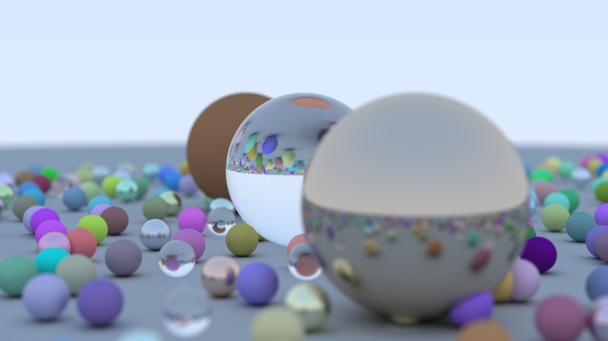
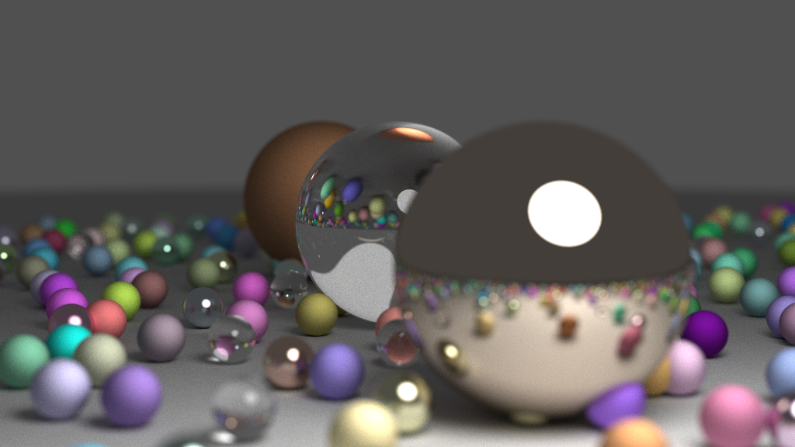
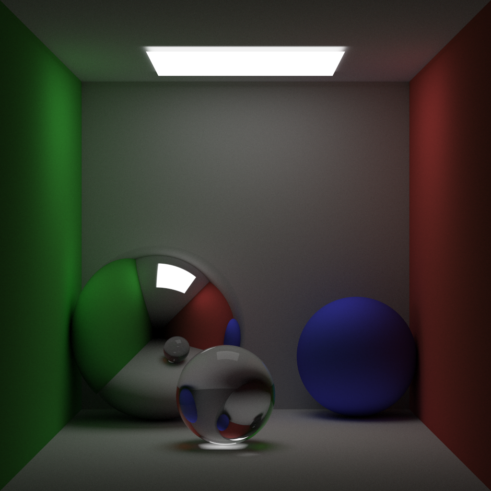

# My Ray Tracing Experiment

## Description

It is my attempt to understand how [Ray Tracing](https://en.wikipedia.org/wiki/Ray_tracing_(graphics)) works and repeat some rendering techniques.

Source code received from `GUI-Graphics` repository, which written with `"Ray Tracing in One Weekend"` book.

## Features:
- [Phong Model](http://en.wikipedia.org/wiki/Phong_reflection_model) and Monte Carlo [Path Tracing](http://en.wikipedia.org/wiki/Path_tracing) Model.
- [Depth of field](https://en.wikipedia.org/wiki/Depth_of_field) effect.
- [Caustic](https://en.wikipedia.org/wiki/Caustic_(optics)) effect(received by rendering algorithm).
- Natural shadows(received by rendering algorithm).
- Polymorphism of objects and materials: it's possible to set any material for each object.
- Objects:
  - Sphere
  - Triangle
- Materials:
  - Metal
  - Dielectric
  - Diffuse
  - Glow
- Objects with materials:
  - Sky

## Limitations:
- Impossible to optimize.
- Impossible to create dotty light source.
- Very long rendering.

## Demo1

Image with uniform lighting from sky. 

Size: `1024 x 576`.

`2000 samples` per pixel.

`4h 33m` rendering time.

## Demo2

Image with light from glowing sphere in empty space. 

Size: `1024 x 576`. 

`4000 samples` per pixel. 

`9h 1m` rendering time.

## Demo3

Image with light from sqare lamp, with walls. 

Size: `1024 x 1024`. 

`5000 samples` per pixel. 

`5h 47m` rendering time.

## Demo4

Animation of torus rotating. Torus is implicit surface.

Size: `500 x 250`. 

`90` frames.

`400 samples` per pixel. 

`42h 28m 46s` rendering time.